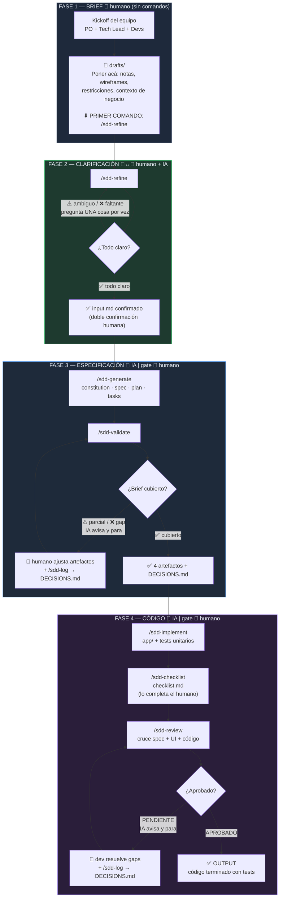

# SDD Workflow — Guía de uso

Este modelo funciona con cualquier agente de IA que soporte comandos o prompts en archivos `.md`.
Los ejemplos usan Claude Code (`/comando`), pero los archivos de comandos son portables a Copilot, Cursor u otros.

---

## Grafo del ciclo



---

## El ciclo completo

```
━━━━━━━━━━━━━━━━━━━━━━━━━━━━━━━━━━━━━━━━━━━━━━━━
 FASE 1 — BRIEF                [lidera: humano]
━━━━━━━━━━━━━━━━━━━━━━━━━━━━━━━━━━━━━━━━━━━━━━━━
  Kickoff del equipo (PO + Tech Lead + Devs)
  El equipo escribe borradores crudos:
    notas de reunión, wireframes en texto,
    restricciones técnicas, contexto de negocio
  Output: archivos en drafts/

━━━━━━━━━━━━━━━━━━━━━━━━━━━━━━━━━━━━━━━━━━━━━━━━
 FASE 2 — CLARIFICACIÓN        [lidera: humano + IA]
━━━━━━━━━━━━━━━━━━━━━━━━━━━━━━━━━━━━━━━━━━━━━━━━
  /sdd-refine
  IA analiza borradores e identifica:
    ✅ claro / ⚠️ ambiguo / ❌ faltante
  Loop de grilling: pregunta UNA cosa por vez
  y repite hasta que todo esté en estado CLARO.
  La IA nunca toma decisiones de negocio sola.
  Requiere confirmación humana antes de cerrar.
  Output: input.md confirmado

━━━━━━━━━━━━━━━━━━━━━━━━━━━━━━━━━━━━━━━━━━━━━━━━
 FASE 3 — ESPECIFICACIÓN       [lidera: IA]
━━━━━━━━━━━━━━━━━━━━━━━━━━━━━━━━━━━━━━━━━━━━━━━━
  /sdd-generate
  Lee input.md y genera los 4 artefactos:
    • constitution.md  (principios MUST/PROHIBITED)
    • spec.md          (user stories + Given/When/Then)
    • plan.md          (arquitectura + estructura)
    • tasks.md         (tareas TDD ordenadas)

  /sdd-validate  [gate de gobernanza]
  Compara input.md vs los 4 artefactos.
  Reporta: ✅ cubierto / ⚠️ parcial / ❌ sin cobertura
  Si hay gaps → avisa, espera, NO modifica solo.
  El humano ajusta los artefactos y corre /sdd-log.

  /sdd-log  [trazabilidad]
  Registra en DECISIONS.md cada decisión que
  desvía o amplía el brief original.
  Output: constitution.md + spec.md + plan.md
        + tasks.md + DECISIONS.md

━━━━━━━━━━━━━━━━━━━━━━━━━━━━━━━━━━━━━━━━━━━━━━━━
 FASE 4 — CÓDIGO               [lidera: IA]
━━━━━━━━━━━━━━━━━━━━━━━━━━━━━━━━━━━━━━━━━━━━━━━━
  /sdd-implement
  Lee los 4 artefactos e implementa todas las
  tareas de tasks.md en orden (TDD).
  Genera código + tests unitarios.

  /sdd-checklist  [verificación manual]
  Lee spec.md + plan.md + tasks.md.
  Genera checklist.md con criterios que los tests
  no pueden cubrir: UX, accesibilidad, seguridad.
  Lo completa un humano antes del review final.

  /sdd-review  [gate de gobernanza]
  Lee spec.md + código generado.
  Verifica que cada Given/When/Then tiene test.
  Si hay gaps → avisa, espera, NO agrega código solo.
  Output: app/ + checklist.md + reporte APROBADO/PENDIENTE
━━━━━━━━━━━━━━━━━━━━━━━━━━━━━━━━━━━━━━━━━━━━━━━━
 MANTENIMIENTO — cada sprint     [👤 Tech Lead]
━━━━━━━━━━━━━━━━━━━━━━━━━━━━━━━━━━━━━━━━━━━━━━━━
  /sdd-health
  Audita todos los artefactos activos.
  Detecta: archivos sobredimensionados, principios
  contradictorios, tasks completadas no archivadas,
  user stories canceladas o sin código.
  Solo reporta — no modifica nada solo.
  Si el equipo aprueba el archivado → /sdd-log.
━━━━━━━━━━━━━━━━━━━━━━━━━━━━━━━━━━━━━━━━━━━━━━━━
 OUTPUT: código terminado con tests
━━━━━━━━━━━━━━━━━━━━━━━━━━━━━━━━━━━━━━━━━━━━━━━━
```

---

## Estructura de archivos

```
── PLANTILLA (archivos del template) ──────────────────────
sdd-model/
├── README.md                    ← descripción pública del modelo
├── CLAUDE.md                    ← contexto automático para Claude
├── WORKFLOW.md                  ← este archivo
├── AGENT-HANDOFF.md             ← contexto de sesión para onboarding de agentes
├── graph-render.html            ← HTML para renderizar el grafo como PNG
├── drafts/
│   └── README.md                ← instrucciones de qué poner en drafts/
└── .claude/
    ├── settings.json            ← permisos para Claude Code
    └── commands/
        ├── sdd-explain.md       ← ONBOARDING: explica el modelo completo
        ├── sdd-refine.md        ← FASE 2: grilling → input.md
        ├── sdd-generate.md      ← FASE 3: input.md → 4 artefactos
        ├── sdd-validate.md      ← FASE 3: quality gate
        ├── sdd-log.md           ← FASE 3/4: registrar decisiones
        ├── sdd-implement.md     ← FASE 4: artefactos → código
        ├── sdd-checklist.md     ← FASE 4: checklist verificación manual
        ├── sdd-review.md        ← FASE 4: verificación final
        └── sdd-health.md        ← MANTENIMIENTO: auditoría por sprint

── RUNTIME (se crean al usar el modelo) ───────────────────
constitution.md                  ← global del proyecto (≤ 60 líneas)
DECISIONS.md                     ← trazabilidad global via /sdd-log
specs/
└── 001-[nombre-feature]/
    ├── input.md                 ← FASE 2: output de /sdd-refine
    ├── spec.md                  ← FASE 3: generado (≤ 80 líneas)
    ├── plan.md                  ← FASE 3: generado (≤ 50 líneas)
    ├── tasks.md                 ← FASE 3: generado (≤ 40 líneas activas)
    └── checklist.md             ← FASE 4: generado por /sdd-checklist
app/                             ← FASE 4: generado por /sdd-implement
```

---

## Quién hace qué

| Fase | Responsable humano | Responsable IA |
|---|---|---|
| **1 — Brief** | PO + Tech Lead (kickoff, borradores) | — |
| **2 — Clarificación** | PO + Tech Lead (responder, confirmar) | Claude (`/sdd-refine`) |
| **3 — Especificación** | Tech Lead (revisar, resolver gaps, firmar) | Claude (`/sdd-generate`, `/sdd-validate`, `/sdd-log`) |
| **4 — Código** | Dev / Tech Lead (completar checklist + review final) | Claude (`/sdd-implement`, `/sdd-checklist`, `/sdd-review`) |
| **Mantenimiento** | Tech Lead (cada sprint, aprobar archivado) | Claude (`/sdd-health`) |

---

## Requisitos

- [Claude Code CLI](https://docs.anthropic.com/en/docs/claude-code) instalado
- `pnpm` instalado (`npm install -g pnpm`)
- Node.js 18+
